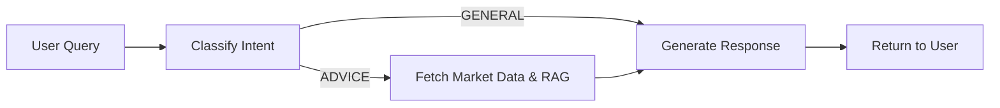

# IRIS - Intelligent Risk-balanced Investment Strategist

An AI-powered financial advisor built on microservices architecture, optimized for Apple Silicon (M4 MacBook Air with 16GB RAM). IRIS combines LLM-based agents with real-time market data to provide personalized investment advice.

## Architecture Overview

IRIS uses a **modular, cloud-native microservices design** with three main components:

- **iris-web-ui** (Next.js/React): Modern, glassmorphic web interface for user interaction
- **iris-api-gateway** (Go/Gin): High-performance API gateway handling all client requests
- **iris-agent-router** (Python/LangGraph): AI agent workflow orchestrator using Ollama LLM

### Technology Stack


| Component | Technology | Purpose |
|-----------|-----------|---------|
| Frontend | Next.js + Tailwind | Responsive web interface |
| Orchestration | K3d + Docker | Lightweight Kubernetes environment |
| API Gateway | Go + Gin Framework | Fast, concurrent request routing |
| AI/Agent Logic | Python + LangGraph + Ollama | LLM inference and agentic workflows |
| Vector Database | LanceDB | Disk-based RAG (Retrieval Augmented Generation) |
| Service Mesh | Linkerd | mTLS, service discovery, observability |
| Market Data | yfinance | Real-time stock prices and financial data |
| LLM Model | Qwen 2.5 14B (quantized) | Local inference on Apple Silicon |

## Prerequisites

### Required Software

#### Windows (Development/Testing)
- **Docker Desktop** (already running per user)
- **Go 1.21+** ([download](https://go.dev/dl/))
- **Python 3.11+** ([download](https://www.python.org/downloads/))
- **Git** for version control

#### macOS/Linux (Full K8s Deployment)
- **Docker Desktop** or Docker Engine
- **k3d** ([installation guide](https://k3d.io/))
- **kubectl** ([installation guide](https://kubernetes.io/docs/tasks/tools/))
- **Go 1.21+**
- **Python 3.11+**
- *Optional*: **Linkerd CLI** for service mesh features

## Project Structure

```
/IRIS
├── Makefile                          # Build, deploy, and test automation
├── README.md                         # This file
├── web-ui/                          # Next.js Web Frontend
│   ├── app/
│   ├── components/
│   └── public/
├── microservices/
│   ├── iris-api-gateway/            # Go API Gateway
│   │   ├── Dockerfile
│   │   ├── go.mod
│   │   ├── go.sum                   # Auto-generated dependencies
│   │   └── main.go
│   ├── iris-agent-router/           # Python AI Agent
│   │   ├── Dockerfile
│   │   ├── requirements.txt
│   │   ├── app.py                   # FastAPI application
│   │   └── core/
│   │       ├── agents/
│   │       │   ├── agent_router.py  # LangGraph workflow
│   │       │   └── test_agent_router.py
│   │       └── tools/
│   │           └── finance_tools.py # Market data & RAG tools
│   └── iris-db-service/             # Placeholder for future DB service
├── infra/
│   └── k8s/                         # Kubernetes manifests
│       ├── 01-namespace.yaml
│       ├── 02-pvc-lancedb.yaml
│       ├── 03-ollama-deployment.yaml
│       └── 05-iris-deployments.yaml
└── tests/
    └── api_integration_test.sh      # Integration test script
```

## Local Development (Windows)

Since the Makefile uses k3d/bash (Mac/Linux tools), Windows users should use the following manual steps:

### 1. Build Go Service

```powershell
cd microservices\iris-api-gateway
go mod download
go mod tidy
go build -o iris-gateway.exe main.go
```

### 2. Install Python Dependencies

```powershell
cd microservices\iris-agent-router
python -m pip install -r requirements.txt
```

**Note:** Installing `lancedb` and `langchain` may take several minutes.

### 3. Run Unit Tests (Python)

```powershell
cd microservices\iris-agent-router
python -m unittest core\agents\test_agent_router.py
```

### 4. Build Docker Images

```powershell
# Build Go Gateway
docker build -t iris-api-gateway:latest microservices\iris-api-gateway

# Build Python Agent Router
docker build -t iris-agent-router:latest microservices\iris-agent-router
```

**Note:** The Python image build will take 5-10 minutes due to dependency compilation.

### 5. Test Module Imports (Local)

```powershell
cd microservices\iris-agent-router
python -c "from core.agents.agent_router import iris_agent; print('Module import successful')"
```

**Expected:** Success message (Ollama connection will fail unless Ollama is running locally).

### 6. Run Web UI (Local)

```powershell
cd web-ui
npm install
npm run dev
```

**Open:** [http://localhost:3000](http://localhost:3000)

## Full Deployment (macOS/Linux with K3d)

### Quick Start

```bash
# One-command deployment (requires k3d, kubectl)
make all
```

This will:
1. Create a K3d cluster with local registry
2. Deploy Ollama LLM service (pulls Qwen 14B model)
3. Build and push microservice Docker images
4. Deploy IRIS services to Kubernetes
5. Run integration tests

### Step-by-Step Deployment

```bash
# 1. Setup infrastructure (K3d cluster, registry, base K8s resources)
make setup

# 2. Build and push Docker images to local registry
make build

# 3. Deploy IRIS services
make deploy

# 4. Run tests
make test
```

### Access the Application

```bash
# Port-forward the Web UI
kubectl port-forward svc/iris-web-ui 3000:3000 -n iris

# Open http://localhost:3000 in your browser
```

```bash
# Port-forward the API Gateway (Optional)
kubectl port-forward svc/iris-api-gateway 8080:8080 -n iris

# Test the chat endpoint
curl -X POST http://localhost:8080/v1/chat \
  -H "Content-Type: application/json" \
  -d '{"user_id": "user_1", "prompt": "Should I invest in NVIDIA stock?"}'
```

## API Reference

### POST /v1/chat

Send a prompt to the IRIS financial advisor agent.

**Request:**
```json
{
  "user_id": "string",
  "prompt": "string"
}
```

**Response:**
```json
{
  "response": "string"
}
```

**Example:**
```bash
curl -X POST http://localhost:8080/v1/chat \
  -H "Content-Type: application/json" \
  -d '{
    "user_id": "investor_123",
    "prompt": "Analyze Tesla stock performance and provide investment advice"
  }'
```

## Agent Workflow

IRIS uses a **LangGraph state machine** to process requests:

1. **Classify Intent**: Determines if the request is for advice, profile updates, or general chat
2. **Fetch Data** (if advice): Retrieves market data via yfinance and RAG context from LanceDB
3. **Generate Response**: Invokes Ollama LLM (Qwen 14B) to produce personalized advice



## Environment Variables

### iris-api-gateway
- `PORT`: API server port (default: `8080`)
- `AGENT_SERVICE_URL`: URL of the agent router service

### iris-agent-router
- `OLLAMA_BASE_URL`: Ollama API endpoint (default: `http://ollama-service:11434`)
- `LANCE_DB_PATH`: Path to LanceDB storage (default: `/data/db/lancedb`)

## Testing

### Unit Tests
```bash
# Python agent tests (mocked LLM)
cd microservices/iris-agent-router
python -m unittest core/agents/test_agent_router.py
```

### Integration Tests
```bash
# Requires K8s deployment
make test-api
```

## Resource Usage (M4 16GB Optimization)

| Service | CPU | Memory | Notes |
|---------|-----|--------|-------|
| iris-web-ui | ~50m | ~100MB | Next.js Node server |
| Ollama (Qwen 14B) | ~1 core | ~10GB | Main memory consumer |
| iris-api-gateway | 100-200m | ~50MB | Go is extremely lightweight |
| iris-agent-router | 200-500m | ~200MB | Python + LangChain overhead |
| LanceDB | Minimal | ~50MB | Disk-based, not RAM-intensive |

**Total Expected RAM Usage:** ~11-12GB (leaving 4-5GB for macOS)

## Troubleshooting

### "Ollama connection failed"
- Ensure Ollama service is running: `kubectl get pods -n iris`
- Check Ollama logs: `kubectl logs -n iris deployment/ollama-deployment`
- The Qwen 14B model pull takes 15-20 minutes on first deployment

### Python import errors
- Verify `__init__.py` files exist in all core module directories
- Reinstall dependencies: `pip install -r requirements.txt --force-reinstall`

### Docker build fails on Windows
- Ensure Docker Desktop is running
- Check available disk space (Python image is ~2GB)
- Use PowerShell (not cmd.exe) for build commands

### K8s deployment fails
- Verify k3d cluster is running: `k3d cluster list`
- Check namespace exists: `kubectl get ns iris`
- Inspect pod status: `kubectl get pods -n iris`

## Cleanup

### Remove K8s Resources
```bash
make clean-infra
```

### Delete K3d Cluster
```bash
make clean-k3d
```

### Full Cleanup (including Docker resources)
```bash
make clean
```

## License

This project is for educational and demonstration purposes.

## Contributing

This is a demonstration project. For questions or issues, please refer to the implementation plan and architecture documentation.

---

**Built with ❤️ for Apple Silicon** | Optimized for M4 MacBook Air 16GB
