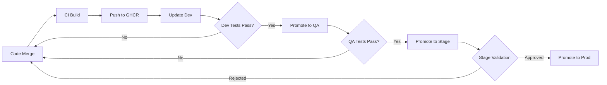

# IRIS GitOps Repository

This directory contains the GitOps configuration for deploying IRIS applications using Argo CD.

## Overview

GitOps is a declarative approach to continuous deployment where Git is the single source of truth for infrastructure and application configuration. Argo CD monitors this repository and automatically synchronizes the desired state to the Kubernetes cluster.

## Directory Structure

```
gitops/
├── README.md                          # This file
├── argocd/
│   └── project.yaml                   # Argo CD project definition with RBAC
├── applications/                      # Argo CD Application manifests (20 total)
│   ├── iris-api-gateway-{env}.yaml    # API Gateway for each environment
│   ├── iris-agent-router-{env}.yaml   # AI Agent Router for each environment
│   ├── iris-web-ui-{env}.yaml         # Web UI for each environment
│   ├── postgresql-{env}.yaml          # PostgreSQL for each environment
│   └── ollama-{env}.yaml              # Ollama LLM for each environment
└── environments/                      # Environment-specific configurations
    ├── dev/
    │   ├── kustomization.yaml         # Kustomize overlay
    │   └── values.yaml                # Dev environment values
    ├── qa/
    ├── stage/
    └── prod/
```

## Environments

| Environment | Auto-Sync | Purpose | Access |
|-------------|-----------|---------|--------|
| **dev** | ✅ Yes | Active development, rapid iteration | Developers |
| **qa** | ✅ Yes | Quality assurance testing | QA Team |
| **stage** | ❌ Manual | Pre-production validation | Release Managers |
| **prod** | ❌ Manual | Production workloads | Release Managers |

## Getting Started

### Prerequisites

- Kubernetes cluster (Docker Desktop with Kubernetes, Minikube, or cloud provider)
- kubectl configured and working
- Python 3.6+ (for deployment script)
- Helm 3.x installed (for validation)
- (Optional) Argo CD CLI

**Check prerequisites**:
```bash
# Verify kubectl
kubectl version --client
kubectl cluster-info

# Verify Python
python --version  # or python3 --version

# Verify Helm (optional)
helm version
```

### Quick Start - Deploy Everything

**Option 1: Using Makefile (Easiest)**

```bash
# From IRIS root directory
make deploy-argocd
```

This will:
1. Check prerequisites (kubectl, cluster connectivity)
2. Install Argo CD if not already installed
3. Prompt you to select which environments to deploy
4. Display access credentials and next steps

**Option 2: Run Python Script Directly**

```bash
# Works on Windows, macOS, and Linux
python scripts/deploy-argocd.py

# Or on some systems
python3 scripts/deploy-argocd.py
```

**Option 3: Manual Step-by-Step**

```bash
# Create namespace
kubectl create namespace argocd

# Install Argo CD
kubectl apply -n argocd -f https://raw.githubusercontent.com/argoproj/argo-cd/stable/manifests/install.yaml

# Wait for Argo CD to be ready
kubectl wait --for=condition=available --timeout=300s deployment/argocd-server -n argocd
```

### 2. Access Argo CD UI

```bash
# Get initial admin password
kubectl -n argocd get secret argocd-initial-admin-secret -o jsonpath="{.data.password}" | base64 -d
echo

# Port forward to access UI
kubectl port-forward svc/argocd-server -n argocd 8080:443

# Open in browser: https://localhost:8080
# Username: admin
# Password: (from command above)
```

### 3. Deploy IRIS Project and Applications

```bash
# Create IRIS project in Argo CD
kubectl apply -f argocd/project.yaml

# Deploy all dev environment applications
kubectl apply -f applications/iris-api-gateway-dev.yaml
kubectl apply -f applications/iris-agent-router-dev.yaml
kubectl apply -f applications/iris-web-ui-dev.yaml
kubectl apply -f applications/postgresql-dev.yaml
kubectl apply -f applications/ollama-dev.yaml

# Or deploy all at once
kubectl apply -f applications/
```

### 4. Verify Deployment

```bash
# Check application status
kubectl get applications -n argocd

# Or use Argo CD CLI
argocd app list

# Watch specific application
argocd app get iris-api-gateway-dev
argocd app sync iris-api-gateway-dev --prune
```

## Environment Promotion Workflow

### Standard Promotion Flow



### Promoting Between Environments

#### Dev to QA (Automated)

The CI/CD pipeline automatically updates the dev environment. QA is configured with auto-sync, so changes propagate automatically after dev validation.

#### QA to Stage (Manual)

```bash
# 1. Update stage environment values
cp environments/qa/values.yaml environments/stage/values.yaml
# Edit stage values as needed

# 2. Commit and push
git add environments/stage/values.yaml
git commit -m "Promote to stage: <commit-sha>"
git push

# 3. Sync stage applications
argocd app sync iris-api-gateway-stage
argocd app sync iris-agent-router-stage
argocd app sync iris-web-ui-stage
argocd app sync postgresql-stage
argocd app sync ollama-stage
```

#### Stage to Prod (Manual with Approval)

```bash
# 1. Create promotion PR
git checkout -b promote-prod-v1.2.3
cp environments/stage/values.yaml environments/prod/values.yaml

git add environments/prod/values.yaml
git commit -m "Promote to production: v1.2.3"
git push origin promote-prod-v1.2.3

# 2. Create PR and get approval from stakeholders

# 3. After merge, sync production
argocd app sync iris-api-gateway-prod
argocd app sync iris-agent-router-prod
argocd app sync iris-web-ui-prod
argocd app sync postgresql-prod --prune=false  # Careful with DB!
argocd app sync ollama-prod
```

## Common Operations

### Sync an Application

```bash
# Sync single app
argocd app sync iris-api-gateway-dev

# Sync with prune (remove extra resources)
argocd app sync iris-api-gateway-dev --prune

# Sync all apps in an environment
argocd app sync -l environment=dev
```

### Rollback

```bash
# Via Argo CD (rollback to previous sync)
argocd app rollback iris-api-gateway-dev

# Via Git (revert commit)
git revert <commit-sha>
git push
# Argo CD will auto-sync the revert
```

### Check Application Health

```bash
# Via Argo CD CLI
argocd app get iris-api-gateway-dev

# Via kubectl
kubectl get applications -n argocd
kubectl describe application iris-api-gateway-dev -n argocd
```

### View Application Diff

```bash
# See what will change before syncing
argocd app diff iris-api-gateway-dev
```

## Troubleshooting

### Application Stuck in "Progressing"

```bash
# Check pod status
kubectl get pods -n iris-dev

# Check application events
kubectl describe application iris-api-gateway-dev -n argocd

# Check sync status
argocd app get iris-api-gateway-dev
```

### Sync Fails

```bash
# View detailed sync status
argocd app get iris-api-gateway-dev

# Check logs
kubectl logs -n argocd deployment/argocd-application-controller

# Force sync (use with caution)
argocd app sync iris-api-gateway-dev --force
```

### Out of Sync Despite No Changes

```bash
# Refresh application (re-compare live vs desired state)
argocd app get iris-api-gateway-dev --refresh

# Hard refresh (bypass cache)
argocd app get iris-api-gateway-dev --hard-refresh
```

## Best Practices

### 1. Never Commit Secrets

- Use External Secrets Operator or Sealed Secrets
- Never commit plain-text secrets to Git
- Use Vault, AWS Secrets Manager, or similar

### 2. Use Sync Waves for Dependencies

```yaml
metadata:
  annotations:
    argocd.argoproj.io/sync-wave: "1"  # Deploy after wave 0
```

### 3. Prune Protection for Stateful Resources

```yaml
metadata:
  annotations:
    argocd.argoproj.io/sync-options: "Prune=false"  # Never auto-delete
```

### 4. Always Test in Dev First

- Never make changes directly to prod
- Test thoroughly in dev/qa/stage before production promotion

### 5. Use Git Commits as Audit Trail

- Make descriptive commit messages
- Reference ticket numbers
- Document why changes were made

## Adding a New Service

1. **Create Helm chart** in `helm/<service-name>/`

2. **Create Argo CD applications** for each environment:
```bash
cp applications/iris-api-gateway-dev.yaml applications/new-service-dev.yaml
# Edit to reference new service
```

3. **Add to environment values**:
```yaml
# environments/dev/values.yaml
new-service:
  enabled: true
  replicas: 1
```

4. **Deploy**:
```bash
kubectl apply -f applications/new-service-dev.yaml
argocd app sync new-service-dev
```

## CI/CD Integration

The GitOps repository is updated automatically by GitHub Actions:

1. **On merge to main**: CI builds containers and updates `environments/dev/values.yaml`
2. **Dev auto-syncs**: Argo CD detects change and deploys to dev cluster
3. **Manual promotion**: After testing, promote to qa/stage/prod

See [DEVOPS_README.md](../DEVOPS_README.md) for complete CI/CD pipeline documentation.

## Security

- All applications run with Pod Security Standards (restricted)
- Network Policies enforce zero-trust networking
- RBAC configured with least-privilege access
- Non-root containers with read-only root filesystem
- Secrets managed via ExternalSecret CRDs (optional)

## Monitoring

- ServiceMonitor resources for Prometheus metrics
- Health checks configured for all applications
- Sync status notifications (Slack, email, etc.) - configure in Argo CD settings

## Support

For issues or questions:
1. Check Argo CD UI for sync status and events
2. Review application logs: `kubectl logs -n iris-dev -l app=<service-name>`
3. Check this README and [DEVOPS_README.md](../DEVOPS_README.md)
4. Consult [Argo CD documentation](https://argo-cd.readthedocs.io/)
